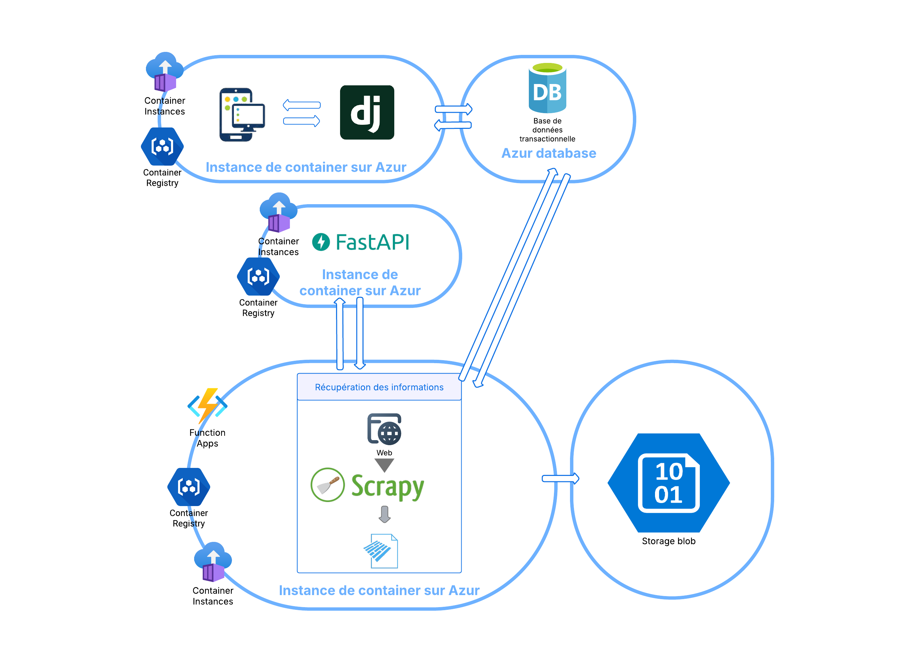

# <p align="center">🎬 New is always better 🎬</p>

<p align="center">
    
</p>


## ➔ Table of Contents

* [➔ Introduction](#-introduction)
* [➔ Context](#-context)
* [➔ Team and Workflow](#-team-and-workflow)
* [➔ Project Structure](#-project-structure)
* [➔ Development choices](#-development-choices)
    - [➔ Model](#-model)
    - [➔ Automation](#-automation)
* [➔ How to Run](#-how-to-run)
    - [➔ API](#-api)
    - [➔ Django](#-django)
    - [➔ Scrapy](#-scrapy)
* [➔ Evaluation Criteria](#-evaluation-criteria)
* [➔ License](#-license)
* [➔ Authors](#-authors)
---
## Introduction
New is always better is an independent cinema with a unique policy: it exclusively screens new movie releases, rotating its program weekly with one new film per screen (120 and 80 seats respectively). The current film selection relies on the manager’s industry monitoring, festival attendance (e.g., Cannes, Deauville), and intuition—an effective but time-consuming approach.

To streamline this process, the cinema seeks to develop an AI-powered decision-making tool that predicts the attendance of new movie releases during their first week. This tool aims to support programming decisions by identifying which films are likely to attract the most viewers, thus optimizing audience engagement and revenue. The final solution should be accessible via a simple web or mobile application, requiring no technical knowledge from the user.

The project combines machine learning, automated **web scraping**, **API development**, and a **web application** within a **cloud environment**, all following an Agile methodology with deliverables distributed across four sprints.

Thanks to this tool, the cinema manager can maximize revenue by assigning the most attractive films to the appropriate theater based on seating capacity, while reducing the time spent on manual monitoring and minimizing risky bets on new releases.
GitHub Project Structure

The project is organized into four main folders, each corresponding to a key step or component of the production pipeline, and each containing its own requirements.txt file to manage specific dependencies.

---
## Context
This project is part of a training program and allows the team to apply all the skills they have acquired throughout the course: core programming languages (**Python** and **SQL**), machine learning models (**linear regressions**, **XGBoost**, **lightGBM**), API development with **FastAPI**, web development with **Django**, and deployment on a cloud platform (**Azure**).

---
## Team and Workflow
The team is a squad of **4 full-stack data/AI developers in training**. The squad follows the **Agile methodology**, and the work was carried out over one month, divided into **four 7-day sprints**.

- **Sprint 1** : focused on defining the project scope, drafting the functional specifications, and estimating the costs.

- **Sprint 2**: involved web scraping, data cleaning and analysis, and the development of the first machine learning models.

- **Sprint 3**: was dedicated to building the first version of the application.

- **Sprint 4**: focused on deploying a fully functional version of the application.

Each sprint began with a **sprint planning meeting** to define the backlog, select user stories, and assign tickets. A **daily stand-up meeting**, led by the **Scrum Master**, was held every morning. At the end of each sprint, a **sprint review** was conducted by the **Product Owner** with the client, followed by a **sprint retrospective** to review and improve the process.

---
## Project Structure

This project includes the following main files and modules:

- **new_is_always_better/**
    - **api/** : This folder contains the API developed with FastAPI, which exposes the machine learning model as a REST service. This API is consumed by the Django application. The folder also includes a dedicated requirements.txt file and a deploy.sh script to facilitate service deployment.
        - **app/** 
            - **utils/**: Utility files and functions.
            - **main.py**: Entry point for the API.
            - **predict.py**: Machine learning model for the prediction of movies success.
            - **schemas.py**: Defines the model of datas needed for predictions.
    - **django/** : This is the front-end web application, developed with Django and styled with TailwindCSS. It allows the cinema manager to view predictions, consult revenue estimates, track performance history, and access key metrics. The folder also includes a requirements.txt file and a deploy.sh script to automate deployment.
        - **NewIsAlwaysBetter/**
            - **app/**
            - **NewIsAlwaysBetter/**
            - **static/**
            - **staticfiles/**
            - **templates/**
            - **theme/**
            - **manage.py**
    - **modelisation/**
        - **ludi/** : Contains notebooks with linear models and the analysis of datas.
        - **victor/** : Contains notebooks with boosted models, the best model and the features engineering.
    - **scrapping/** : This folder contains all the scripts dedicated to the automated collection of data from sources such as Allociné, JB Box Office, and the CNC. Several subfolders (allo_cine, jb_boxoffice, cnc, imdb) are used to organize the scraping by source.
        - **airflow/**
            - **dags/**
                - **scraping_dag.py** Automates the allocine_spider_releases.py execution once a week.
        - **allocine_scrapping/**
            - **allocine_scrapping/**
            - **scrapping/**: Contains logs.
            - **spiders/**
                - **allocine_spider_releases.py**: Gets the last release of movies.
                - **allocine_spider.py**: Gets all the movies and informations about movies released during a defined period.
            - **pipelines.py** : Defines datas processings, storage, calls the API for predictions and stores the results.
            - **runner_releases.py**: Entry point for the allocine_spider_releases.py spider.
            - **runner.py**: Entry point for the allocine_spide.py spider.
        - **cnc_scraper/**
            - **cnc_data/**: Contains all the datas
            - **cnc_scraper/**
                - **spiders/**
                    - **cnc.py** Gets informations about cinema frequentations in France.
                - **pipelines.py** Stores the datas into a parquet file.
        - **ecrantotal_scraper/**
            - **ecrantotal_scraper/**
                - **spiders/**
                    - **ecrantotal_spiders.py** Gets movies scheduled for release in the next three years.
                - **pipelines.py** Stores the datas into a parquet file.
        - **imdb_scraper/**
            - **imdb_scraper/**
                - **spiders/**
                    **imbd_spider.py** Retrieves movies datas from imdb website
                - **pipeline.py** Processes the datas and stores it in parquet file.
        - **jpboxoffice/**
            - **jpboxoffice/**
                - **spiders/**
                    - **jpboxoffice_spider.py** Retrieves the top actors based on their number of ticket sales in France.
        - **plugins/**
        - **deploy.sh** : Allows to deploy the weekly scraping on Azure platform.

The project follows this schematic architecture : 

<p align="center">
    
</p>

---
## Development choices
### Model
The modeling component is the core of the project, with the main objective of predicting a film’s number of theater admissions during its opening week. Several approaches were explored and compared to best meet the client’s specific needs: maximize theater occupancy while considering capacity and profitability constraints.

The final model is a hybrid two-step architecture:
1. National Box Office Prediction

A SARIMA model (Seasonal AutoRegressive Integrated Moving Average) was used to model the weekly national box office time series. This model provides a reliable estimate of the total number of admissions across all cinemas in France.

2. Local Prediction Based on National Forecast

The SARIMA output is then used as a feature in a regression model based on XGBoost, trained to more accurately estimate the potential number of admissions at the local cinema level (approximately 1/2000th of the national total).
This model also incorporates various explanatory variables, such as:

    Film genres

    Nationality

    Cast and director

    Studio

    Available languages

    Runtime

    ...

3. Training and Validation

The XGBoost model was trained using custom train/test splits that preserve the chronological order of data to avoid target leakage.

A custom performance metric was defined to penalize errors more heavily on high-potential films — crucial for maximizing weekly cinema revenue.

Extensive feature engineering was performed to enrich the dataset, including the integration of exogenous variables obtained via web scraping (Twitter, IMDb, etc.).

4. Requests & responses
#### Request

```json
{
  "films": [
    {
      "actors": ["Monica Bellucci", "Vincent Cassel"],
      "date": "2023-05-10T00:00:00",
      "directors": ["Gaspar Noé"],
      "editor": "Carlotta Films",
      "genre": ["Drame", "Thriller"],
      "langage": ["Anglais", "Francais", "Italien", "Espagnol"],
      "length": 90.0,
      "nationality": ["France"],
      "title": "Film Exemple"
    },
    {
      "actors": ["Brad Pitt", "Marion Cotillard"],
      "date": "2023-06-15T00:00:00",
      "directors": ["Quentin Tarantino"],
      "editor": "Sony Pictures",
      "genre": ["Action", "Guerre"],
      "langage": ["Anglais"],
      "length": 120.0,
      "nationality": ["USA"],
      "title": "Autre Film"
    }
  ]
}
```

#### Response

```json
{
  "predictions": [
    {
      "title": "Film Exemple",
      "predicted_affluence": 1234567.89,
      "shap_values": shap en binaire,
      "predicted_affluence_2": 1334567.89,
      "shap_values_2": shap en binaire
    },
    {
      "title": "Autre Film",
      "predicted_affluence": 9876543.21,
      "shap_values": shap en binaire,
      "predicted_affluence_2": 1334567.89,
      "shap_values_2": shap en binaire
    }
  ]
}
```

### Automation
Airflow

An initial version of the automation was implemented using Airflow with a dedicated DAG. However, containerization has proven to be complex. While Airflow runs correctly via a docker-compose.yml, deploying it to Azure remains challenging: it either requires multiple interconnected containers or the use of Kubernetes (AKS).

Moreover, this setup demands that at least one container remains running continuously, which prevents cost optimization and is not ideal for a lightweight, event-driven architecture.

Azure Function


## How to Run

### API
- Python 3.10+
- Docker (optionnel, mais recommandé)

**Local installation**

1. Clone the repository :
   ```bash
   git clone https://github.com/votre-utilisateur/api-prediction-film.git
   cd api-prediction-film
   ```

2. Install the required dependencies:
   ```bash
   pip install -r requirements.txt
   ```

3. Run the API:
   ```bash
   uvicorn app.main:app --host 0.0.0.0 --port 8000 --reload
   ```

**Docker deployment**

1. Construire l'image Docker :
   ```bash
   docker build -t api-prediction-film .
   ```

2. Exécuter le conteneur :
   ```bash
   docker run -p 8000:8000 api-prediction-film
   ```


--- --

## Evaluation Criteria

### Educational Requirements
- Group of 4 members
- Duration: 1 months


### Deliverables
- Link to the GitHub repository
- Oral presentation including testing

---

## Performance Metrics

- The application and API meet the project requirements.
- No obvious security vulnerabilities.

---

## License

[MIT License](LICENSE)

---

## Authors

- **Samuel Thorez**
  <a href="https://github.com/SamuelTD" target="_blank">
      
  </a>
- **Victor Poutot**
  <a href="https://github.com/istaion" target="_blank">
      
  </a>
- **Raouf Addeche**
<a href="https://github.com/RaoufAddeche" target="_blank">
    
  </a>
- **Ludivine Raby**
  <a href="https://github.com/ludivineRB" target="_blank">
      
  </a>

---